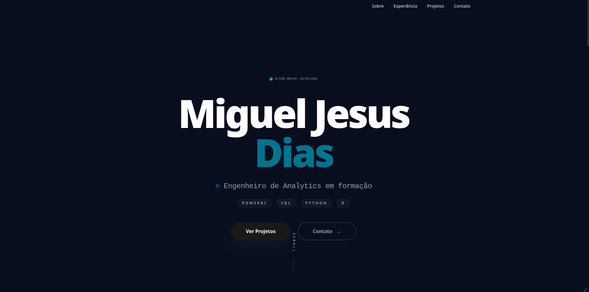

# Meu Portfólio Pessoal 👨‍💻

<div align="center">
  < />
</div>

<br/>

<div align="center">
  <a href="https://mjdias2006-portfolio.vercel.app/" target="_blank">
    
  </a>
</div>

## 📖 Sobre o Projeto

Este repositório contém o código-fonte do meu portfólio pessoal. O objetivo deste site é apresentar meus projetos em destaque, minhas habilidades técnicas, um pouco sobre a minha trajetória e fornecer uma forma fácil de contato. O design foi desenvolvido com foco em performance, acessibilidade e experiência do usuário (UX).

## ✨ Funcionalidades

- **Apresentação Pessoal:** Resumo sobre mim e meus objetivos na área de tecnologia.
- **Galeria de Projetos:** Demonstração dos meus melhores trabalhos com links para os repositórios do GitHub e visualizações ao vivo.
- **Habilidades (Skills):** Exibição das linguagens, frameworks e ferramentas que domino.
- **Design Responsivo:** O site se adapta perfeitamente a qualquer tamanho de tela (mobile, tablet e desktop).
- **Formulário/Links de Contato:** Acesso direto às minhas redes profissionais.

## 🚀 Tecnologias Utilizadas

Este projeto foi construído utilizando as seguintes tecnologias:

> **Nota:** *Edite esta lista de acordo com o que você realmente usou no seu código.*

* **[HTML5 & CSS3](https://developer.mozilla.org/pt-BR/docs/Web)** - Estrutura e estilização.
* **[Next.js](https://nextjs.org/) / [JavaScript (ES6+)](https://developer.mozilla.org/pt-BR/docs/Web/JavaScript)** - Interatividade.
* **[Tailwind CSS](https://tailwindcss.com/)** - Estilização.
* **[Vercel](https://vercel.com/)** - Hospedagem.

## 🛠️ Como rodar o projeto localmente

Caso queira baixar o código e rodar na sua própria máquina, siga os passos abaixo:

### Pré-requisitos
* [Git](https://git-scm.com/) instalado.
* [Node.js](https://nodejs.org/) instalado *(se o projeto usar npm/yarn)*.

### Passo a passo

1. Clone o repositório:
```bash
git clone [https://github.com/mjdias2006/SEU-REPOSITORIO.git](https://github.com/mjdias2006/SEU-REPOSITORIO.git)
